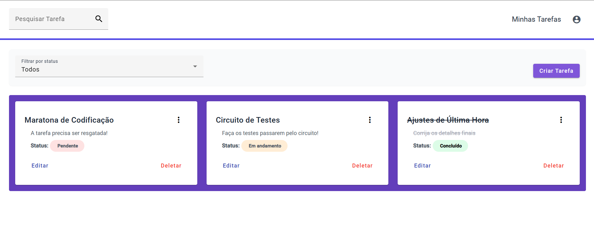

# Gerenciador de Tarefas

Este é um aplicativo de gerenciamento de tarefas desenvolvido com Angular. Ele permite aos usuários criar, editar, excluir e visualizar tarefas, além de filtrar tarefas por status.



## Funcionalidades 🚀

- **Pesquisar tarefas**: Pesquisar tarefas pelo título 🔍.
- **Filtrar tarefas por status**: Filtrar as tarefas por status como "Pendente", "Em andamento" ou "Concluído" 🗂️.
- **Criar tarefa**: Adicionar novas tarefas 📝.
- **Editar tarefa**: Atualizar o título, descrição e status de tarefas existentes ✏️.
- **Excluir tarefa**: Remover tarefas 🗑️.
- **Visualizar detalhes da tarefa**: Exibir os detalhes completos de uma tarefa 📄.

## Instalação ⚙️

Siga os passos abaixo para configurar o projeto em sua máquina local.

### Pré-requisitos 📦

Antes de começar, certifique-se de ter o **Node.js** versão **18 ou superior** e o **npm** instalados.

#### Instalando o Node.js e npm

1. Acesse a página oficial do Node.js: [https://nodejs.org/](https://nodejs.org/) 🌐
2. Baixe a versão **18** ou superior 📥.
3. Siga as instruções do instalador para o seu sistema operacional 💻.

Após a instalação, você pode verificar se o Node.js e o npm foram instalados corretamente utilizando os seguintes comandos no terminal:

```bash
node -v
npm -v
```
## Passos para instalação 🛠️

1. Clone o repositório para sua máquina local:
```bash
git clone https://github.com/sueniasantos/task-manager.git
```
2. Instale as dependências do projeto com o npm:
```bash
npm install
```
4. Após a instalação das dependências, inicie o servidor de desenvolvimento:
```bash
ng serve
```

A aplicação estará disponível em http://localhost:4200/ 🌍.
